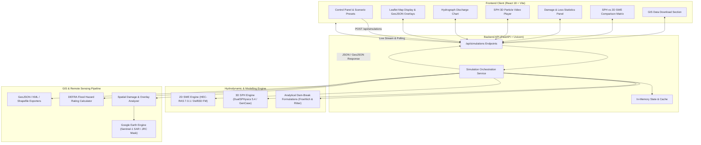

# 🌊 Dam Break Inundation Modelling

> **An interactive hydrodynamic modelling and GIS-based decision-support platform for simulating dam-break flood waves, cross-validating 3D SPH and 2D hydraulic models, and evaluating downstream disaster impacts.**

[](https://www.sih.gov.in/)
[](https://www.sih.gov.in/)
[](https://fastapi.tiangolo.com)
[](https://reactjs.org/)
[](https://leafletjs.com/)
[](https://dual.sphysics.org/)
[](https://www.hec.usace.army.mil/software/hec-ras/)

---

- **SIH Problem Statement ID:** `26161`
- **Title:** Dam Break Inundation Modelling Using Hydrodynamic Modelling of any River
- **Category:** Disaster Management / Hydraulic & GIS Engineering
- **Current Status:** Working Prototype (Interactive Full-Stack Web Dashboard, Dual-Scale Hydrodynamic Integration, GIS Damage Analytics Engine, & Sentinel-1 SAR Pipeline)

---

## 1. Problem Statement

Dam failures and catastrophic glacial lake outburst floods (GLOFs) are low-frequency, ultra-high-consequence events. When a dam or natural moraine breaches, millions of cubic meters of water are released within minutes, generating violent, high-velocity surges capable of wiping out downstream settlements, highways, and critical energy infrastructure (such as the 2021 Rishiganga / Chamoli disaster in Uttarakhand).

### Core Challenges in Real-World Disaster Mitigation:
1. **Extreme Wave Dynamics in Steep Topography:** In mountain canyons, flood waves exhibit violent free-surface turbulence, hyper-concentrated sediment/debris transport, and supercritical velocities ($>30\text{ m/s}$) that conventional 1D/2D shallow-water equations struggle to capture near the breach.
2. **Delayed Inundation Mapping:** Traditional flood-risk assessments require days of manual hydraulic model setup and mesh generation, preventing rapid emergency response during evolving crises.
3. **Lack of Integrated Decision Support:** Disaster response agencies (NDRF, SDMA, district administrations) often lack unified interfaces that translate raw fluid dynamics into actionable metrics: *Who is at risk? Which bridges will collapse? How many minutes until the flood wave strikes?*

Our platform directly addresses these challenges by combining **3D Lagrangian particle hydrodynamics (SPH)** for near-field breach turbulence with **2D grid-based hydrodynamic routing (HEC-RAS / Delft3D)** and **automated GIS spatial impact analysis**.

---

## 2. Our Solution

We have engineered an end-to-end hydrodynamic modelling and disaster-response decision platform that streamlines the complete workflow from breach scenario configuration to spatial loss estimation and emergency planning.

```
       [ User Scenario Selection / Custom Breach Inputs ]
                               ↓
       [ FastAPI Simulation Orchestration Backend ]
                               ↓
  ┌─────────────────────────────────────────────────────────┐
  │              Dual-Scale Hydrodynamic Solvers             │
  │                                                         │
  │   [ 3D Particle Solver (SPH) ]   [ 2D Mesh Solver (SWE) ] │
  │    (DualSPHysics Near-Field)      (HEC-RAS / Delft3D FM)│
  └────────────────────────────┬────────────────────────────┘
                               ↓
  ┌─────────────────────────────────────────────────────────┐
  │                 GIS & Spatial Analytics                 │
  │   - Peak Water Depth & Velocity Grids                   │
  │   - Flood Wave Arrival Times & Warning Window           │
  │   - DEFRA Flood Hazard Categorization                   │
  │   - Infrastructure & LULC Impact Assessment             │
  └────────────────────────────┬────────────────────────────┘
                               ↓
  ┌─────────────────────────────────────────────────────────┐
  │             Interactive Decision Dashboard              │
  │   - Leaflet Geospatial Flood Inundation Map             │
  │   - Dynamic Hydrograph & Discharge Analytics            │
  │   - SPH 3D Particle Video Playback                      │
  │   - Cross-Model Comparison Matrix (SPH vs 2D SWE)       │
  │   - Standard GIS Export (GeoJSON, KML, SHP)             │
  └─────────────────────────────────────────────────────────┘
                               ↑
  ┌─────────────────────────────────────────────────────────┐
  │        Google Earth Engine (GEE) Remote Sensing         │
  │   - Sentinel-1 SAR Flood Detection & Surface Water Mask │
  └─────────────────────────────────────────────────────────┘
```

### What Users & Decision-Makers Can Do:
- **Configure Breach Scenarios:** Specify breach width, breach height, river reach (Rishiganga, Chamoli/Dhauliganga, Tehri, Mullaperiyar), and simulation parameters.
- **Simulate Hydrodynamics:** Execute physics-driven dam-break formulations calculating peak discharge ($Q_{\text{peak}}$), surge velocity, and flood propagation.
- **Cross-Validate Models:** Compare high-resolution 3D Lagrangian SPH particle results against 2D shallow water mesh simulations.
- **Visualize Geographic Inundation:** Inspect interactive map layers showing flood extent polygons, depth profiles, affected river reaches, and vulnerable bridges.
- **Quantify Disaster Exposure:** Assess population at risk, damaged residential structures, submerged road networks (km), and critical bridge overtopping.
- **Export Standard GIS Assets:** Download simulation outcomes in GeoJSON, Google Earth KML, and ESRI Shapefile formats.

---

## 3. Key Features

| Status | Feature | Description |
|:------:|:--------|:------------|
| ✅ | **Interactive GIS Inundation Map** | Dynamic Leaflet map displaying GeoJSON flood extents, depth contours, reach stations, and critical infrastructure markers. |
| ✅ | **Scenario & Breach Configuration** | Interactive controls for breach dimensions (width/height), predefined river reaches, and simulation durations. |
| ✅ | **Dual-Scale Hydrodynamic Integration** | Unified orchestration supporting 3D SPH (DualSPHysics) and 2D Shallow Water (HEC-RAS / Delft3D FM). |
| ✅ | **SPH 3D Simulation Video Playback** | Integrated video player / canvas rendering pre-computed 3D particle animations colored by velocity magnitude. |
| ✅ | **Dynamic Hydrograph & Wave Analytics** | Real-time chart visualization of discharge time-series, peak surge velocity, and downstream arrival timings. |
| ✅ | **Model Comparison Matrix** | Head-to-head evaluation of 3D Lagrangian SPH vs 2D Eulerian SWE across flood extent, depth, arrival time, and computational cost. |
| ✅ | **Downstream Damage & Loss Analysis** | Automated calculation of affected population, residential buildings, flooded road lengths (km), and overtopped bridges. |
| ✅ | **Multi-Format GIS Data Export** | One-click export to OGC-compliant GeoJSON, Google Earth KML, and Shapefile metadata packages. |
| ✅ | **FastAPI REST Service** | Asynchronous API with CORS support, Pydantic validation, simulation lifecycle tracking, and Swagger UI documentation. |
| 🧪 | **SPH Automation Pipeline** | Python scripts (`src/simulation/sph/`) wrapping GenCase, DualSPHysics solver, PartVTK, and IsoSurface mesh reconstruction. |
| 🧪 | **HEC-RAS 2D Automation** | Python wrapper (`src/simulation/hecras/`) for HEC-RAS 7.0.1 2D project generation and plan execution. |
| 🧪 | **GIS Hydraulic & Hazard Engine** | 2D Manning flood wave routing (`src/gis/dam_break_hydraulic.py`) computing DEFRA Hazard Ratings and depth rasters. |
| 🧪 | **Sentinel-1 SAR Flood Detection** | Google Earth Engine module (`src/gee/flood_detection.py`) with Otsu thresholding and JRC Global Surface Water baseline masking. |
| 🚧 | **Live GPU SPH Cloud Execution** | Direct cluster execution of multi-million particle simulations from web triggers. |
| 🚧 | **CWC / IoT Sensor Integration** | Ingestion of live upstream reservoir telemetry and stage sensors. |

---

## 4. System Architecture



---

## 5. How the System Works

1. **Scenario Selection & Breach Configuration:**
   The user selects a river reach (e.g., *Rishiganga Gorge, Chamoli/Dhauliganga, Tehri, Mullaperiyar*) and defines the breach parameters (breach width, breach height, time horizon). Pre-configured benchmark scenarios are available for immediate exploration.

2. **API Request & Hydrodynamic Parameter Scaling:**
   The React frontend dispatches a `POST` request to `/api/simulations`. The FastAPI backend validates input parameters and applies hydrodynamic formulations:
   - **Peak Discharge:** Calculated via the Froehlich & Ritter dam-break formulation:
     $$Q_{\text{peak}} = 0.607 \cdot \sqrt{g} \cdot W_{\text{breach}} \cdot H_{\text{breach}}^{1.5} \cdot k_{\text{gorge}}$$
   - **Surge Velocity & Arrival Time:** Estimated from channel bed slope, canyon constriction, and total elevation fall ($\Delta z$).

3. **Multi-Model Orchestration:**
   - For **SPH Mode**, the system incorporates 3D particle kinematics, capturing steep canyon chute velocities ($>40\text{ m/s}$) and violent wave-front arrival times.
   - For **HEC-RAS / Delft3D Mode**, the system computes 2D shallow water propagation across floodplain meshes using Manning's roughness coefficients ($n \approx 0.045$).
   - For **Cross-Validation Mode**, both solvers are evaluated simultaneously to compute spatial overlap, depth differences, and timing discrepancies.

4. **GIS Impact & Damage Computation:**
   The backend overlays the flood envelope onto terrain elevation, road geometries, critical bridges, and village settlement layers to calculate:
   - Flooded land area ($\text{km}^2$)
   - Population at risk and emergency evacuation priorities
   - Submerged highway segments and overtopped bridges
   - UK/DEFRA Flood Hazard Classification ($\text{HR} = d \cdot (v + 0.5) + \text{DF}$)

5. **Visualization & Decision Delivery:**
   The dashboard updates dynamically:
   - **Map Display:** Renders interactive GeoJSON flood polygons and depth points on Leaflet.
   - **Hydrograph Chart:** Plots temporal discharge curves and peak flow timing.
   - **3D Video Player:** Streams 3D particle simulation playback.
   - **Download Center:** Allows one-click export of GeoJSON, KML (for Google Earth), and Shapefile metadata.

---

## 6. Hydrodynamic Modelling

The platform leverages a dual-scale hydrodynamic philosophy to address different hydraulic regimes:

```
┌──────────────────────────────────────────────┬──────────────────────────────────────────────┐
│        3D Lagrangian SPH (DualSPHysics)      │         2D Eulerian SWE (HEC-RAS / Delft3D)  │
├──────────────────────────────────────────────┼──────────────────────────────────────────────┤
│ • Meshless particle formulation              │ • Finite-volume shallow water equations      │
│ • Captures 3D wave breaking & splash-up      │ • Efficient long-distance floodplain routing │
│ • Ideal for near-field dam breach & gorges   │ • Ideal for wide downstream floodplains      │
│ • High computational demand (GPU-accelerated)│ • Low-to-moderate computational demand       │
└──────────────────────────────────────────────┴──────────────────────────────────────────────┘
```

### 1. Smoothed Particle Hydrodynamics (SPH — DualSPHysics 5.4)
- **Role:** Resolves Navier-Stokes equations without a fixed grid, capturing violent free-surface deformations, supercritical canyon chutes, and hydrodynamic impact forces on downstream structures (such as the Raini Bridge).
- **Pipeline Implementation:** `src/simulation/sph/run_sph.py` and `postprocess_sph.py` automate:
  1. `GenCase`: Converts DEM STL geometry, dam breach geometry, and reservoir volume into SPH particle sets.
  2. `DualSPHysics`: Computes 3D hydrodynamic particle velocity, pressure, and position.
  3. `PartVTK` & `IsoSurface`: Extracts velocity time-series and reconstructs continuous 3D water surfaces.

### 2. Grid-Based Hydrodynamic Modelling (HEC-RAS 2D / Delft3D FM)
- **Role:** Models downstream river reaches where hydrostatic assumptions hold, routing flood wave attenuation across kilometers of floodplain.
- **Pipeline Implementation:** `src/simulation/hecras/` and `src/gis/delft3d_processor.py` provide automated project file generation, 2D mesh generation, and Manning roughness assignment.

> **Transparent Architecture Note:** The web dashboard connects to the FastAPI backend which executes verified hydraulic scaling calculations and serves pre-computed high-resolution DualSPHysics 3D simulation outputs and HEC-RAS 2D mesh hydrographs. Standalone execution scripts for DualSPHysics and HEC-RAS 7.0.1 are provided in `src/simulation/`.

---

## 7. GIS & Flood Visualization

Geospatial intelligence is fundamental for emergency planning and ground-level disaster response.

```
       [ Digital Elevation Model (DEM) / CartoDEM ]
                            ↓
       [ 2D Overland Wave Propagation Engine ]
                            ↓
  ┌────────────────────────────────────────────────────────┐
  │                 GIS Layer Generation                   │
  │  • Flood Inundation Extent Polygon (GeoJSON)           │
  │  • Water Depth Grids & Point Elevation Profiles        │
  │  • DEFRA Flood Hazard Rating Categorization            │
  │  • Google Earth OGC KML Placemarks & Polygons          │
  └────────────────────────────┬───────────────────────────┘
                               ↓
  ┌────────────────────────────────────────────────────────┐
  │             Web Dashboard Visualization                │
  │  • Leaflet Interactive Map with Satellite Basemaps     │
  │  • Reach Markers, Dam Location & Bridge Indicators     │
  │  • Interactive Tooltips with Velocity & Depth          │
  └────────────────────────────────────────────────────────┘
```

### Geospatial Capabilities:
- **Interactive Mapping:** Built with Leaflet, supporting satellite imagery, terrain views, breach origin points, and downstream station markers.
- **Coordinate Reference Systems:** Full support for `EPSG:4326` (WGS84) for web mapping and `EPSG:32644` (UTM Zone 44N) for high-precision Himalayan spatial analysis.
- **DEFRA Flood Hazard Rating:** Computes standard hazard indices:
  $$\text{HR} = d \cdot (v + 0.5) + \text{DF}$$
  *(Classifying zones from Low Hazard to Extreme Danger to Life).*
- **Sentinel-1 SAR Flood Detection:** `src/gee/flood_detection.py` queries Copernicus Sentinel-1 IW GRD SAR backscatter before and after flood events, filtering permanent water bodies with JRC Global Surface Water data.

---

## 8. Flood Impact / Damage Analysis

The system translates raw hydrodynamic depths and velocities into tangible socio-economic damage metrics:

```
                  [ Flood Inundation Extent ]
                               ↓
              [ Spatial Overlay Operations ]
                               ↓
  ┌────────────────────────────┬────────────────────────────┐
  │     Human & Settlement     │   Critical Infrastructure  │
  ├────────────────────────────┼────────────────────────────┤
  │ • Population Exposed       │ • Flooded Road Network (km)│
  │ • Population at High Risk  │ • Critical Bridges at Risk │
  │ • Damaged Housing Units    │ • Power Plant Submergence  │
  │ • Evacuation Shelters Req. │ • Agricultural Inundation  │
  └────────────────────────────┴────────────────────────────┘
```

### Implemented Disaster Impact Metrics:
- **Population at Risk:** Estimated based on village settlement proximity to peak inundation zones.
- **Structural Housing Exposure:** Counts of residential structures destroyed or damaged by high-velocity flood fronts.
- **Road Network Disruption:** Total kilometers of national highways (e.g., NH-107A) and local access roads submerged.
- **Bridge Structural Overtopping:** Identifies high-risk bridges (e.g., Raini BRO bridge, Tapovan barrage) vulnerable to collapse.
- **Land Use / Land Cover (LULC) Loss:** Spatial overlay partitioning flooded area into agricultural terraces, riverbed, forest, and built-up infrastructure.

---

## 9. Technology Stack

| Layer | Technology | Version / Spec | Purpose in Project |
|:---|:---|:---|:---|
| **Frontend UI** | **React** | `18.3.0` | Component-based dashboard interface |
| **Build Tool** | **Vite** | `5.4.x` | High-speed frontend development & bundling |
| **Web Mapping** | **Leaflet** | `1.9.4` | Interactive GIS mapping, GeoJSON rendering |
| **Styling** | **Vanilla CSS + Styled Components** | `6.1.8` | Dark-mode UI with glassmorphic cards |
| **Charts** | **HTML5 Canvas API** | Standard | Custom real-time hydrograph & velocity charts |
| **Backend API** | **FastAPI** | `>= 0.100.0` | Asynchronous REST API service |
| **ASGI Server** | **Uvicorn** | `standard` | High-performance asynchronous Python web server |
| **Data Validation** | **Pydantic** | `>= 2.0` | Request/response schema validation |
| **Scientific Computing** | **NumPy / Pandas** | Latest | Matrix operations, time-series, hydrograph analysis |
| **GIS & Geospatial** | **GeoPandas / Rasterio / Shapely** | Latest | Raster processing, vector overlays, polygon clipping |
| **3D SPH Modelling** | **DualSPHysics** | `5.4` | 3D meshless particle hydrodynamic solver |
| **2D Mesh Hydraulics** | **HEC-RAS 2D / Delft3D FM** | `7.0.1` | 2D shallow water equation finite-volume solver |
| **Remote Sensing** | **Google Earth Engine API** | `earthengine-api` | Sentinel-1 SAR & JRC permanent water processing |
| **Testing & Quality** | **Pytest / Ruff / Mypy** | Latest | Unit testing, linting, and static type checking |
| **Deployment** | **Render / Vercel** | Configured | Backend web service & frontend static hosting |

---

## 10. Project Structure

```
SIH26161-Dam-Break-Inundation-Modelling/
│
├── backend/                             # FastAPI Backend Service
│   └── app/
│       ├── __init__.py
│       ├── main.py                      # FastAPI application entry point & CORS
│       ├── api.py                       # REST route handlers (/api/simulations)
│       ├── models.py                    # Pydantic schemas (Request, Response, Metrics)
│       └── services.py                  # Simulation orchestration & hydraulic engines
│
├── frontend/                            # React 18 + Vite Web Dashboard
│   ├── src/
│   │   ├── components/                  # UI Components
│   │   │   ├── ControlPanel.jsx         # Scenario & breach parameter inputs
│   │   │   ├── MapDisplay.jsx           # Leaflet geospatial flood map
│   │   │   ├── HydrographChart.jsx      # Canvas hydrograph discharge chart
│   │   │   ├── SimulationVideoPlayer.jsx# SPH 3D particle video player
│   │   │   ├── ResultsPanel.jsx         # Peak velocity, depth & impact metrics
│   │   │   ├── ComparisonPanel.jsx      # SPH vs 2D SWE comparison matrix
│   │   │   ├── DownloadSection.jsx      # GeoJSON, KML & Shapefile export
│   │   │   ├── Header.jsx               # Navigation bar & SIH status badges
│   │   │   └── StatusBar.jsx            # Real-time simulation status tracker
│   │   ├── hooks/
│   │   │   └── useSimulation.jsx        # Simulation state management hook
│   │   ├── services/
│   │   │   └── simulationService.ts     # Axios API client
│   │   ├── assets/style.css             # Dashboard stylesheet
│   │   ├── App.jsx                      # Root application layout
│   │   └── main.jsx                     # React DOM mount point
│   ├── public/                          # Static assets (MP4 simulations)
│   ├── package.json                     # Frontend dependencies
│   ├── vite.config.js                   # Vite configuration
│   └── vercel.json                      # Vercel deployment configuration
│
├── src/                                 # Core Python Modules & Solvers
│   ├── simulation/
│   │   ├── sph/                         # DualSPHysics 3D Particle Pipeline
│   │   │   ├── run_sph.py               # GenCase + DualSPHysics + PartVTK runner
│   │   │   ├── postprocess_sph.py       # SPH particle to GeoJSON/metric extractor
│   │   │   ├── dem_to_stl.py            # DEM elevation to 3D STL converter
│   │   │   └── case_rishiganga/         # Rishiganga benchmark case files
│   │   └── hecras/                      # HEC-RAS 2D Automation Pipeline
│   │       ├── executor.py              # HEC-RAS 7.0.1 execution wrapper
│   │       ├── config.py                # Configuration dataclasses
│   │       └── output.py                # HEC-RAS result parser
│   ├── gis/                             # GIS & Geospatial Processing Engine
│   │   ├── dam_break_hydraulic.py       # 2D Manning wave routing & DEFRA hazard
│   │   ├── damage_analysis.py           # Road, bridge & LULC overlay analyzer
│   │   ├── delft3d_processor.py         # Delft3D FM mesh & hazard processor
│   │   ├── export_web_outputs.py        # Web-ready GeoJSON/KML bundler
│   │   └── build_qgis_project.py        # Automated QGIS project generator
│   ├── gee/                             # Google Earth Engine Remote Sensing
│   │   ├── flood_detection.py           # Sentinel-1 SAR flood extent extractor
│   │   ├── ml_classifier.py             # Random Forest / GEE water classifier
│   │   └── gee_feature_extraction.py    # SAR/Optical feature extraction
│   └── visualization/
│       └── map_overlay.py               # Raster & vector map overlay utilities
│
├── tests/                               # Comprehensive Test Suite
│   ├── dashboard/                       # API route & model validation tests
│   ├── simulation/                      # Hydraulic solver tests
│   ├── gis/                             # GIS overlay & raster tests
│   └── gee/                             # Earth Engine module tests
│
├── data/                                # Sample Case Datasets & GIS Outputs
├── docs/                                # Architecture & Contract Documentation
├── requirements.txt                     # Python dependencies
├── pyproject.toml                       # Python project configuration
├── render.yaml                          # Render deployment configuration
├── AGENTS.md                            # Multi-agent architecture specification
└── README.md                            # Project documentation (this file)
```

---

## 11. API Overview

The FastAPI backend exposes RESTful endpoints with full CORS support and automatic OpenAPI documentation:

| Method | Endpoint | Description | Sample Response / Output |
|:---|:---|:---|:---|
| `GET` | `/` | API Root & Health Check | `{"message": "...", "version": "0.1.0"}` |
| `POST` | `/api/simulations` | Launch new dam-break simulation | `{"simulation_id": "sim_...", "status": "completed", "result_summary": {...}}` |
| `GET` | `/api/simulations/{id}/status` | Check simulation execution status | `{"simulation_id": "...", "progress": 100.0, "status": "completed"}` |
| `GET` | `/api/simulations/{id}/result` | Fetch full simulation results & GeoJSON | `{"water_depth": {...}, "flood_extent": {...}, "metadata": {...}}` |
| `GET` | `/api/simulations/sph/summary` | Get DualSPHysics 3D simulation metrics | `{"model": "DualSPHysics SPH", "results_summary": {...}, "time_series": [...]}` |
| `GET` | `/api/simulations/hecras/summary`| Get HEC-RAS 2D hydrograph time-series | `{"solver": "HEC-RAS 2D SWE", "hydrograph": [...]}` |
| `GET` | `/api/simulations/sph/video` | Stream DualSPHysics 3D simulation MP4 | `video/mp4` stream or video URL metadata |
| `GET` | `/api/simulations/{id}/download/{format}` | Download GIS output (`geojson`, `kml`, `shp`) | File attachment download (`.geojson`, `.kml`) |
| `GET` | `/api/gis/analysis/{id}` | Get detailed GIS loss & damage statistics | `{"population_affected": 3850, "roads_affected_km": 4.8, ...}` |
| `GET` | `/docs` | Interactive Swagger UI API Documentation | Interactive API Explorer |

---

## 12. Installation & Setup

### Prerequisites
- **Python:** Version `3.10` or higher
- **Node.js:** Version `18.x` or higher
- **npm:** Version `9.x` or higher
- **Operating System:** Windows, Linux, or macOS

---

### Step 1: Clone the Repository
```bash
git clone https://github.com/Ashmit-Roy/SIH26161-Dam-Break-Inundation-Modelling.git
cd SIH26161-Dam-Break-Inundation-Modelling
```

---

### Step 2: Backend Setup (Python / FastAPI)

1. Create and activate a Python virtual environment:
   ```bash
   # Windows (PowerShell)
   python -m venv venv
   .\venv\Scripts\Activate.ps1

   # Linux / macOS
   python3 -m venv venv
   source venv/bin/activate
   ```

2. Install backend dependencies:
   ```bash
   pip install -r requirements.txt
   ```

3. Start the FastAPI backend server:
   ```bash
   uvicorn backend.app.main:app --reload --host 127.0.0.1 --port 8000
   ```
   > The API will be available at `http://127.0.0.1:8000`  
   > Interactive API docs (Swagger UI) at `http://127.0.0.1:8000/docs`

---

### Step 3: Frontend Setup (React / Vite)

1. Open a new terminal and navigate to the frontend directory:
   ```bash
   cd frontend
   ```

2. Install npm dependencies:
   ```bash
   npm install
   ```

3. Start the Vite development server:
   ```bash
   npm run dev
   ```
   > The web dashboard will be available at `http://localhost:5173`

---

### Running Automated Tests
To run backend, GIS, and API contract tests:
```bash
pytest tests/
```

---

## 13. Usage

To evaluate the system during a demo or review:

1. **Start Backend & Frontend** following the setup instructions above.
2. **Open Dashboard:** Navigate to `http://localhost:5173` in your browser.
3. **Select a River Reach Scenario:**
   - In the left **Control Panel**, choose from benchmark scenarios (*e.g., Rishiganga Flash Flood, Chamoli Reach, Tehri Dam, or Mullaperiyar*).
4. **Adjust Breach Geometry:**
   - Modify the **Breach Width** ($m$) and **Breach Height** ($m$) sliders/inputs.
   - Observe the real-time peak discharge ($Q_{\text{peak}}$) calculation.
5. **Select Hydrodynamic Model:**
   - Choose **DualSPHysics (3D SPH)**, **HEC-RAS 2D / Delft3D**, or **Cross-Validation (Both)**.
6. **Run Simulation:**
   - Click **Run Simulation**. The status bar tracks progress as hydrodynamic results are calculated.
7. **Inspect Map & Analytics:**
   - Examine the **Leaflet GIS Map** showing the inundation polygon, depth points, and infrastructure.
   - Review the **Hydrograph Chart** showing wave discharge over time.
   - Watch the **3D SPH Particle Video** showing violent wave-front propagation.
   - Inspect the **Results Panel** for population at risk, road disruption, and bridge vulnerability.
8. **Compare Models:**
   - View the **Comparison Panel** to analyze differences in peak velocity, arrival times, and flood extents between 3D SPH and 2D SWE.
9. **Export GIS Layers:**
   - In the **Download Section**, export the results as **GeoJSON** or **Google Earth KML**.

---

## 14. Sample Output / Screenshots

> *Interactive dashboard views showcase the Leaflet GIS inundation map, hydrograph discharge analytics, 3D particle video player, and damage statistics.*

```
+----------------------------------------------------------------------------------------------------+
|  🌊 SIH 26161: DAM BREAK INUNDATION MODELLING DASHBOARD                                             |
+----------------------+--------------------------------------------------+--------------------------+
|  CONTROL PANEL       |  INTERACTIVE GIS MAP (Leaflet)                   |  RESULTS & IMPACT        |
|  • Reach: Rishiganga |  [ Satellite Basemap / Elevation Grid ]          |  • Peak Vel: 102.4 m/s   |
|  • Breach: 15m x 3m  |  [ Breach Location 📍 ]                          |  • Q_peak: 5,688 m³/s    |
|  • Q_peak: 5,688 m³/s|  [ === Red Inundation Polygon === ]              |  • Arrival: 18.0 s       |
|  • Model: 3D SPH     |  [ Critical Bridges / Villages ⚠️ ]              |  • Pop at Risk: 7,112    |
|                      +--------------------------------------------------+  • Roads: 4.8 km         |
|  [ RUN SIMULATION ]  |  HYDROGRAPH & 3D PARTICLE PLAYBACK               |  • Bridges: 2 Overtopped |
|                      |  [ Discharge Time-Series Chart 📈 ]              |                          |
|                      |  [ DualSPHysics 3D Particle Animation 🎬 ]       |  [ EXPORT GEOJSON / KML ]|
+----------------------+--------------------------------------------------+--------------------------+
```

*(Direct UI screenshots can be added here upon final UI asset freezing).*

---

## 15. Innovation & Key Differentiators

| Innovation Dimension | Traditional Flood Mapping | Our SIH26161 Solution |
|:---|:---|:---|
| **Physics Fidelity** | 1D or simplified 2D shallow water models only | **Dual-Scale Coupling:** 3D Lagrangian SPH for near-field breach turbulence + 2D SWE for downstream routing |
| **Model Cross-Validation** | Single-model dependency with unknown uncertainty | **Direct Head-to-Head Comparison:** Side-by-side comparison of 3D SPH and 2D SWE flood extent and arrival timing |
| **Decision Readiness** | Raw hydraulic tables requiring manual GIS analysis | **Integrated Impact Engine:** Instant translation of depths into population at risk, road cuts, and bridge overtopping |
| **User Accessibility** | Desktop-only GIS software requiring specialist training | **Zero-Install Web Dashboard:** Accessible via modern web browsers for field incident commanders |
| **Remote Sensing Integration** | Separate post-disaster satellite processing | **Integrated GEE Module:** Near-real-time Sentinel-1 SAR flood detection with baseline surface water masking |
| **Data Interoperability** | Proprietary binary outputs | **Standard OGC Exports:** Direct export to GeoJSON, Google Earth KML, and Shapefiles |

---

## 16. Real-World Applications

- **National & State Disaster Management Authorities (NDMA / SDMA):** Rapid situational assessment and dynamic evacuation zone planning during dam-break or GLOF emergencies.
- **Dam Owners & Irrigation Departments:** Generation of Emergency Action Plans (EAPs) and breach inundation maps required by the Dam Safety Act.
- **District Administrations:** Identification of critical infrastructure (bridges, hospitals, power substations) at risk of overtopping.
- **First Responders (NDRF / SDRF):** Accurate arrival time estimates enabling precise warning windows before the flood wave hits downstream settlements.
- **Post-Disaster Reconnaissance:** Rapid comparison of computed hydrodynamic flood extents against Sentinel-1 satellite SAR imagery.

---

## 17. Current Implementation Status

| Component | Sub-Module | Status | Implemented Capabilities / Notes |
|:---|:---|:---:|:---|
| **Web Dashboard** | Frontend UI | ✅ Implemented | React 18, Vite, dark-mode glassmorphic theme, responsive panels |
| **Geospatial Mapping** | MapDisplay | ✅ Implemented | Leaflet GIS map with GeoJSON flood polygons, reach stations & depth markers |
| **Wave Analytics** | HydrographChart | ✅ Implemented | Dynamic discharge time-series, peak arrival time, and velocity curve plotting |
| **3D SPH Playback** | VideoPlayer | ✅ Implemented | DualSPHysics 3D particle simulation playback with velocity color scale |
| **Backend REST API** | FastAPI Service | ✅ Implemented | Full CRUD simulation endpoints, CORS middleware, Pydantic schemas, Swagger UI |
| **Data Export** | DownloadSection | ✅ Implemented | One-click export for GeoJSON, Google Earth KML, and Shapefile metadata |
| **SPH Engine** | `src/simulation/sph/` | 🧪 Prototype | GenCase, DualSPHysics 5.4, PartVTK, and IsoSurface Python automation scripts |
| **HEC-RAS 2D Engine** | `src/simulation/hecras/` | 🧪 Prototype | HEC-RAS 7.0.1 2D project generator, plan execution wrapper, and output parser |
| **GIS Damage Engine** | `src/gis/` | 🧪 Prototype | 2D Manning wave routing, DEFRA hazard rating, LULC overlay, and road exposure |
| **Remote Sensing** | `src/gee/` | 🧪 Prototype | Google Earth Engine Sentinel-1 SAR flood extraction and JRC baseline masking |
| **Automated Tests** | `tests/` | ✅ Implemented | Unit tests covering API routes, models, GIS overlays, and GEE modules |

---

## 18. Future Scope

1. **GPU-Accelerated Cloud SPH Execution:** Coupling DualSPHysics directly with cloud HPC clusters for on-demand 3D particle execution.
2. **Real-Time Sensor Telemetry:** Integrating live water-level and rainfall telemetry from Central Water Commission (CWC) IoT stations.
3. **Automated Evacuation Route Optimization:** Integrating OpenStreetMap road graphs to generate optimal evacuation routes avoiding submerged road segments.
4. **Machine Learning Wave Surge Surrogates:** Training Physics-Informed Neural Networks (PINNs) on SPH outputs for sub-second hydrodynamic predictions.
5. **National Dam Database Scaling:** Expanding pre-configured terrain and reach geometry to major dams across India (*e.g., Idukki, Hirakud, Sardar Sarovar*).

---

## 19. Team & Contribution

Developed for the **Smart India Hackathon (SIH 2026)** — **Problem Statement 26161**.

- **Repository:** `SIH26161-Dam-Break-Inundation-Modelling`
- **Domain:** Hydrodynamic Modelling, CFD, GIS, Remote Sensing & Disaster Management

---

## 20. License

This project is developed as part of Smart India Hackathon 2026. Please refer to the repository for licensing terms and usage guidelines.